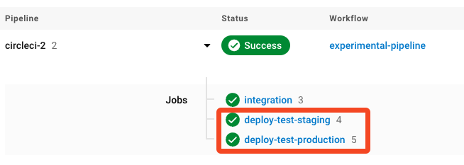

# 02_02 CircleCI

## Recommended Resources
- [CircleCI Quickstart guide](https://circleci.com/docs/getting-started/)

## Prerequisites
Having the following items in place before starting this lab will help you have a smooth experience.

1. A [GitHub account](https://github.com/join) is required to host the code for the sample application. *NOTE: You may need to be an admin for any repositories you want to integrate with CircleCI.*
2. A [CircleCI account](https://circleci.com/signup/). CircleCI supports GitHub, Bitbucket, and GitLab projects.  This lab focuses on the GitHub integration.
3. An [Amazon Web Services account](https://aws.amazon.com/free) is needed to deploy and host the sample application used for the deployment target.
4. The sample application should be in place before starting.  See [00_06 About the Exercise Files](../../ch0_introduction/00_06_about_the_exercise_files/README.md) for steps to deploy the sample application.
5. The exercise files for the course should be downloaded and accessible on your local system.

## Create a GitHub repo for the sample application code
Because this course covers multiple tools, a dedicated repo is need for each tool to prevent unexpected deployments to the sample-application.

1. Create a new GitHub repo. Give the repo a name and description.  Please select **Public** for the repo visibility to simplify access.  Select the option to add a README file and select **Python** when adding a `.gitignore` file.
2. From the repo home page, select **Add file -> Upload files**.
3. Select **choose your files** and browse to the exercise files for this lesson on your local system.
4. Select all of the files and then select **Open**.
5. After the files have been uploaded, enter a commit message and select **Commit changes**.

## Relocate the CircleCI configuration file in the repo
*NOTE: THIS IS A KEY STEP TO GET THE CIRCLECI CONFIGURATION WORKING.*

The CircleCI configuration file, [config.yml](config.yml), needs to be located inside the repo in a hidden directory named `.circleci`.  This step provides directions for getting the file in place.

1. From the root of your repo, select the file `config.yml`.
2. Begin editing the file by selecting the pencil icon on the top right of the file listing or by typing `e` on your keyboard.
3. In the filename field, type `.circleci/`.  This will create the `.circleci` directory and place `config.yml` inside the directory.  See the images below for clarification.

    Before adding the `.circleci` directory:
    

    After adding the `.circleci` directory:
    

4. Select **Commit changes...**.  On the dialog that appears, select **Commit changes**.

## Repo connection, and project parameters
### 1. Set up your CircleCI account
With your CircleCI account in place, set up a connection to the repo where the exercise files are stored and then set up the project parameters.

### 2. Repo connection and project parameters
#### 2.1 Connect to GitHub repo
1. Log into your CircleCI account and, from the menu on the left-hand side of the page, select **Projects**.
2. Locate the repo you created to store the exercise files and select the **Set Up Project** button next to it.  *Note: If you've already set up the project, select the three dots next to "Unfollow Project" and select **Project Settings**. Proceed to **Configure project parameters** below).*
3. Confirm that "Fastest: Use the .circleci/config.yml in my repo" is selected.  In the "From which branch" field, enter **main**.  The display should display a check mark and the message "`.circleci/config.yml` found on this branch".  Select **Set Up Project**.
4. A build will start running immediately.  The `integration` job may fun successfully but the `deploy-test-staging` job will fail because the parameters for the project (specifically the AWS credentials for the service account) have not been put in place.  You'll take care of that in the next step.

#### 2.2 Configure project parameters
1. On the page for the failed build, select the button with three dots on the far right and then select **Project Settings**.  Or, from the home page of the project, select the **Project Settings** button on the top, far right of the page.

2. On the "Project Settings" page, select **Environment Variables**.
3. For each of the following project parameters, select **Add Environment Variable** and, using the values from the "Outputs" tab of the Cloudformation stack for the sample application, add the names and values for the following project parameters as environment variables.  *Note: CircleCI hides values for all user defined environment variables by default.  Environment variables can not be viewed or edited after they are added.  They must be recreated to be changed or updated.  Also note that variables can be imported from other projects by selecting **Import Variables** and selecting the project containing the variables to be imported.*

   - AWS_ACCESS_KEY_ID
   - AWS_DEFAULT_REGION
   - AWS_SECRET_ACCESS_KEY
   - PRODUCTION_FUNCTION_NAME
   - PRODUCTION_URL
   - STAGING_FUNCTION_NAME
   - STAGING_URL

   After all 7 parameters are in place, your configuration should appear as follows:

   

### Select a branch and trigger the pipeline
1. From the homepage of the project, use the dropdown menu after the project name to select the `main` branch. Then select the **Trigger Pipeline** button. Then select the **Trigger Pipeline**.
2. Select the icon displaying "Running" to view the pipeline in progress.
3. Allow the build to complete.
4. If any errors are encountered, review the logs and make corrections as needed.  Consider reviewing the configuration steps for the parameters.  If you are not able to resolve the errors, please post a question on LinkedIn Learning in the course Q&A section.
5. Open the URLs for the sample application's staging and production environments.  For both environments, confirm that the deployment platform is "CircleCI" and the build number matches the last successful build number. *Note: Because the CircleCI pipeline uses different jobs to deploy the staging and production environments, the build number will be different for each environment.*

    

## Additional Information
- [Starter workflows and sample configurations](https://circleci.com/docs/sample-config/)
- [AWS CLI orb](https://circleci.com/developer/orbs/orb/circleci/aws-cli#usage-install_aws_cli)
- TODO: Linkable reference is needed for 'Error messages can be checked via AI ("no code or proprietary data shared")'

[Next: 02_03 SaaS Tool Summary](../02_03_saas_tool_summary/README.md)
